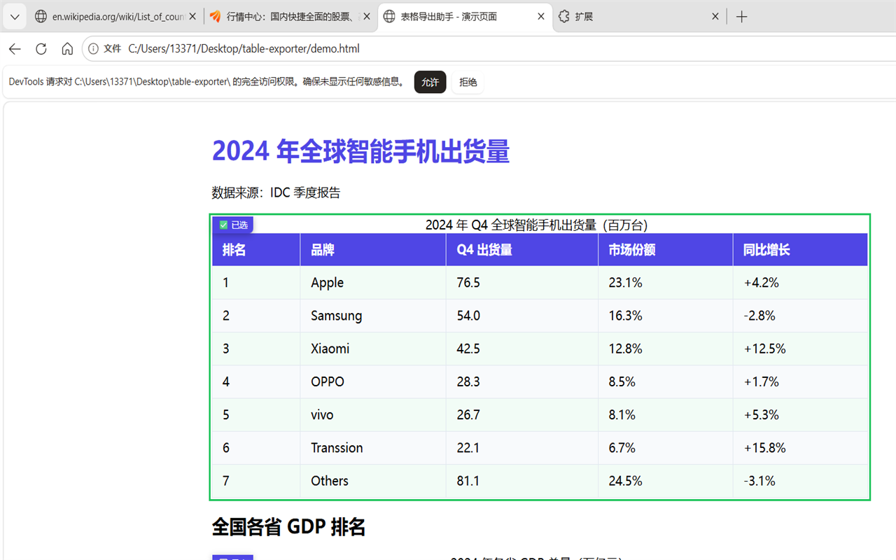

# 表格导出助手 / Table Exporter

检测网页 HTML 表格，一键导出为 CSV 文件。纯本地处理，不收集任何数据。



## 功能

- 自动检测网页中所有 `<table>` 元素
- 表格左上角显示浮动标签，点击选中/取消
- 右下角浮动按钮，弹出面板列出所有表格
- 支持多选，合并导出为单个 CSV 文件
- UTF-8 BOM 编码，Excel / WPS 打开不乱码
- 纯本地处理，无网络请求，无数据收集

## 快速安装

### 方式一：Tampermonkey 脚本（推荐）

1. 浏览器安装 [Tampermonkey](https://www.tampermonkey.net/)
2. 点此链接自动安装：  
   [table-exporter.user.js](https://cdn.jsdelivr.net/gh/XMLY321/table-exporter@master/table-exporter.user.js)

### 方式二：浏览器扩展（开发者模式）

1. 克隆仓库或 [下载 ZIP](https://github.com/XMLY321/table-exporter/archive/refs/heads/master.zip)
2. 打开 `edge://extensions/` 或 `chrome://extensions/`
3. 开启 **开发者模式**
4. 点击 **加载已解压的扩展程序**，选择项目文件夹

### 商店版本

Chrome Web Store / Edge Add-ons 即将上线。

## 使用

1. 打开任意包含表格的网页
2. 表格左上角出现 `导出` 标签
3. 点击标签选中（边框变绿，文字变"已选"）
4. 点击右下角紫色按钮，打开面板
5. 勾选要导出的表格，点 **导出 CSV**
6. 文件自动下载

**本地测试：** 用浏览器打开项目中的 [demo.html](demo.html)，包含两个示例表格。

## 项目结构

```
table-exporter/
├── table-exporter.user.js  # Tampermonkey 油猴脚本（推荐安装）
├── manifest.json           # 浏览器扩展配置 (Manifest V3)
├── content/
│   ├── content.js          # 扩展版：表格检测、高亮、数据提取
│   └── content.css         # 扩展版：高亮样式
├── popup/
│   ├── popup.html          # 扩展版：弹窗界面
│   ├── popup.css           # 扩展版：弹窗样式
│   └── popup.js            # 扩展版：表格列表、CSV 导出
├── icons/                  # 扩展图标 (16/48/128 px)
├── demo.html               # 本地演示页面
├── privacy.html            # 隐私政策
└── screenshot.png          # 截图
```

## 技术栈

纯原生 HTML / CSS / JavaScript，零依赖，零构建工具。

- Manifest V3（扩展版）
- Tampermonkey / Greasemonkey（脚本版）
- CSV 生成（UTF-8 BOM，Excel 兼容）
- Shadow DOM 样式隔离

## 隐私

本扩展 **不收集、不存储、不上传** 任何用户数据。详见 [隐私政策](privacy.html)。

权限说明：
- `activeTab` — 仅在点击扩展图标后读取当前页面表格
- `downloads` — 仅用于保存 CSV 文件到本地

## 许可

MIT License

## 链接

- [GitHub 仓库](https://github.com/XMLY321/table-exporter)
- [问题反馈](https://github.com/XMLY321/table-exporter/issues)
- [隐私政策](https://xmly321.github.io/table-exporter/privacy.html)
